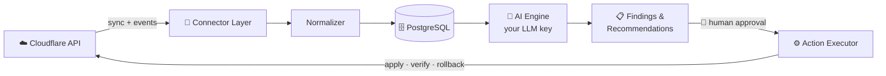

<p align="center">
  
</p>

<p align="center">
  <a href="./LICENSE"></a>
  
  
  
  
</p>

<h3 align="center">Your edge sees everything. Korugan tells you what it means — and fixes it, with your consent.</h3>

<p align="center"><i><b>Korugan</b> (Turkish): a hardened bunker guarding a frontier — from the root <b>koru-</b>, "to protect."</i></p>

---

Korugan connects to your edge providers — **Cloudflare first** — ingests traffic, security, DNS, SSL and cache signals, and puts an AI operations engineer on top: one that explains problems in plain language, drafts the exact fix, and applies it only when you approve.

**Not** another dashboard. Dashboards show you *what*. Korugan is built to answer *why* — and *what to do about it*.

## ⚡ The problem

```text
03:12  ▲ blocked requests +212%          ← your dashboard
03:12  "Credential-stuffing burst against /wp-login.php from 3 ASNs.
        Rule 4711 is catching 94% of it; the rest slips through as
        low-and-slow. Here's a rate-limit rule scoped to the login
        path. Blast radius: none for real users. Apply?"
                                          ← Korugan
```

- 🔍 **Explain** — ask about your traffic in plain language; answers cite your actual events, never generic advice
- 🚨 **Detect** — continuous analysis: attack patterns, misconfigurations, expiring certs, cache waste, origin failures
- 🛠️ **Recommend** — every finding becomes a provider-ready change with a diff, a rationale and a rollback plan
- ✅ **Apply with approval** — you click approve; Korugan executes, watches the result, auto-rolls back on regression
- 🤖 **Automate (opt-in)** — narrow, reversible, policy-scoped autonomy — the last step of the ladder, never the first

## 🧠 How it works



The connector layer normalizes every provider into one event/action schema. The AI engine reasons through internal tools only — **it never touches provider credentials** and it cannot apply anything itself. Execution lives in a separate, audited pipeline behind human approval.

## 🔑 Bring Your Own Key

Korugan sells you nothing and meters you nothing: plug in an LLM account you already have. Your server talks to your model provider directly — or to no one, with a local model.

| Provider | Why pick it |
|---|---|
| 🧭 **OpenRouter** | *Recommended:* one key → hundreds of models, visible pricing |
| 🟠 **Anthropic (Claude)** | Frontier reasoning for rule generation |
| ⚪ **OpenAI (ChatGPT)** | Native adapter; template for all compatible APIs |
| 🔵 **DeepSeek** | Absurdly cheap for routine event digests |
| 🖥️ **Ollama / local** | Free, offline, zero data egress |

💸 Built-in cost discipline: per-call token accounting, daily/monthly budgets with hard stops, analysis caching, per-task model tiering (cheap model for digests, strong model for remediation plans).

🔒 **No key? Still useful.** Zero-key mode runs the full collector + dashboard + rule-based detections. AI lights up when a key arrives. Keys are AES-256-GCM sealed at rest, masked in the UI, redacted from logs.

## 🪜 The autonomy ladder

Trust is earned in levels — per zone, per action type. Everything starts read-only.

| | Level | What Korugan may do |
|---|---|---|
| 👁️ | **L0 · Observe** | Ingest, analyze, explain. The default, forever, until *you* change it |
| 💡 | **L1 · Recommend** | Propose changes: diff + rationale + blast radius + rollback plan |
| ✅ | **L2 · Approved apply** | Execute what you approve; verify after; auto-rollback on regression |
| 🤖 | **L3 · Autonomous** | Act inside narrow, reversible, rate-limited policies you wrote |

Hard lines no level unlocks: DNS deletes, certificate changes, zone lifecycle. Always manual. Forever.

## 🌍 Providers

| Provider | Status |
|---|---|
| ☁️ Cloudflare | 🛠️ **in development** |
| 🟧 AWS CloudFront | 🔜 planned |
| ⚡ Fastly | 🔜 planned |
| 🐰 BunnyCDN | 🔜 planned |
| ▲ Vercel | 🔜 planned |
| 🌐 Akamai · Azure Front Door | 🔜 planned |
| 🧱 Nginx · Traefik · HAProxy · K8s Ingress | 🔜 planned (agent-based) |

One Go interface + a conformance test suite per provider. The abstraction is the product.

## 🧰 Stack

**Go** (chi, stdlib `net/http`) · **PostgreSQL** · **Next.js + Tailwind + shadcn/ui** · single binary, self-host first. Heavier machinery (ClickHouse, NATS, Redis) joins only when real volume demands it — ambition goes into the product, not the deployment diagram.

## 🚧 Status

Pre-alpha, building in the open. The backend core is real and tested; the web UI is next.

- [x] Architecture & connector contract designed
- [x] Cloudflare connector — zones, DNS, firewall events (fixture-tested)
- [x] Event ingestion, normalization, dedup, cursor-based sync
- [x] Rule-based detections (blocked-traffic spikes, config drift)
- [x] BYOK AI engine — OpenRouter / OpenAI / DeepSeek / Anthropic / Ollama, zero-key mode, budgets
- [x] Recommend → approve → apply → verify → rollback pipeline (WAF rules, cache purge)
- [x] REST API + CI (unit + Postgres integration, green)
- [ ] Web UI (Next.js)
- [ ] Live multi-provider expansion

⭐ **Star the repo** to follow along — the interesting parts are just starting.

## 🚀 Quickstart

```bash
git clone https://github.com/behramkendra/korugan.git
cd korugan
cp .env.example .env          # set DATABASE_URL; add a Cloudflare token + LLM key when ready
docker compose up -d db       # or point DATABASE_URL at any Postgres 16+
make run
```

Migrations apply automatically on boot. With no LLM key set, Korugan runs in **zero-key mode** — full collector, dashboard and rule-based findings, AI off until you add a key. See [.env.example](./.env.example).

## 📚 Documentation

| Document | Contents |
|---|---|
| [docs/VISION.md](./docs/VISION.md) | The problem, the thesis, what Korugan is and is not |
| [docs/ARCHITECTURE.md](./docs/ARCHITECTURE.md) | Components, module layout, phased infrastructure, autonomy gates, decision log |
| [docs/CONNECTORS.md](./docs/CONNECTORS.md) | Connector interface, event/action schemas, Cloudflare mapping |
| [docs/AI_ENGINE.md](./docs/AI_ENGINE.md) | BYOK design, agent loop, guardrails, cost controls |
| [docs/DATABASE.md](./docs/DATABASE.md) | Schema, indexing, scaling plan |
| [docs/API.md](./docs/API.md) | HTTP endpoints |
| [ROADMAP.md](./ROADMAP.md) | Milestones P0–P5 with done-criteria |
| [CONTRIBUTING.md](./CONTRIBUTING.md) | Dev setup, style, commit conventions |

## 📄 License

[Apache-2.0](./LICENSE) © Korugan Contributors
