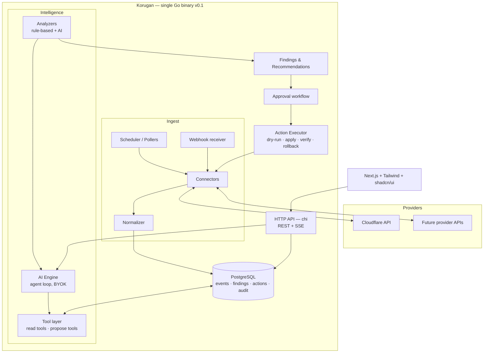

# Architecture

Korugan is a **modular monolith** with an event-driven core, built hexagonal (ports & adapters). The target architecture below is deliberately larger than the first release; infrastructure is adopted in phases, gated on measurable triggers, never speculatively.

## Principles

1. **Hexagonal, strictly.** Domain logic depends on interfaces (`Connector`, `LLMProvider`, `EventStore`); vendors live in adapters. Swapping Cloudflare for Fastly, or Claude for DeepSeek, touches zero domain code.
2. **Modular monolith, extraction-ready.** One binary, internal modules with enforced boundaries (no cross-module imports except through interfaces). A module becomes a service only when scaling data says so — the NATS seam is designed in advance so extraction is a deployment change, not a rewrite.
3. **Every AI action is auditable.** Prompt, tool calls, data windows, recommendation, diff, approver, execution result, rollback: one traceable chain per action, stored durably.
4. **The AI never holds credentials.** LLMs call internal tools; the tool layer enforces capability, autonomy level and scope; only the action executor talks to provider APIs.
5. **Fail read-only.** Any subsystem failure degrades toward observation, never toward unsupervised action.

## System overview



## Module layout

```
github.com/behramkendra/korugan
├── cmd/
│   └── korugan/            # single entrypoint: API + scheduler + workers
├── internal/
│   ├── domain/              # entities & invariants: Zone, Event, Finding,
│   │                        # Recommendation, Action, Policy, AutonomyLevel
│   ├── connector/           # Connector interface + registry (port)
│   │   └── cloudflare/      # first adapter
│   ├── ingest/              # pollers, webhook receiver, normalizer, dedup
│   ├── ai/                  # LLMProvider port, agent loop, tool registry,
│   │   ├── provider/        # anthropic, openai-compatible, openrouter, ollama
│   │   └── tools/           # query_events, get_zone_config, propose_action, ...
│   ├── analysis/            # scheduled analyzers, finding lifecycle
│   ├── action/              # approval workflow, executor, verify, rollback
│   ├── store/               # repositories (Postgres via pgx), migrations
│   ├── crypto/              # AES-256-GCM secret sealing (keys, tokens)
│   ├── httpapi/             # chi router, handlers, SSE, authn/authz middleware
│   └── obs/                 # OpenTelemetry setup, structured logging (slog)
├── web/                     # Next.js app (Tailwind, shadcn/ui)
├── migrations/
└── deploy/                  # docker-compose, k8s manifests (later phases)
```

Module boundary rule: `domain` imports nothing internal; everything else imports `domain`; siblings communicate through interfaces defined by the consumer. Enforced with `go vet` + depguard lint in CI.

## Data flow

**Ingest (write path).** Scheduler triggers per-zone sync and event pulls at provider-safe intervals → connector fetches raw payloads → normalizer maps them to the common `Event` schema (raw payload preserved as JSONB) → dedup by provider event ID → append to `events` (monthly partitions, BRIN index on `ts`).

**Analyze.** Analyzers run on schedules and on ingest triggers. Cheap rule-based detectors (cert expiry, error-rate thresholds, config drift) run always and cost nothing. AI analyzers batch event windows and run only when an LLM key is configured — producing `Finding`s with severity, evidence (event IDs), and optionally a `Recommendation` carrying a provider-ready change + diff + rollback plan.

**Act (gated path).** Recommendation → approval (UI/API, recorded with actor + timestamp) → executor re-validates preconditions → optional provider dry-run → apply via connector → post-apply verification window (error budget watch) → auto-rollback on regression. Every transition lands in `audit_log`.

**Read path.** UI/API queries repositories directly (CQRS-lite: separate read models/queries, same database). Full CQRS with a separate analytical store only arrives with ClickHouse — see below.

## Phased infrastructure

| Component | Enters at | Trigger — adopt when… | Until then |
|---|---|---|---|
| PostgreSQL 16+ | v0.1 | — (system of record: config, events, findings, actions, audit) | — |
| SQLite (evaluated) | — | rejected: concurrent writers + JSONB analytics too limiting | — |
| ClickHouse | ~P4 | sustained > ~5M events/day, >30-day analytical queries slow on partitioned PG, or dashboard p95 > 2s | PG partitions + rollup tables |
| NATS (JetStream) | ~P4/P5 | second deployable service exists (e.g. proxy agents), or webhook fan-out needs durable queueing | in-process event bus (Go channels behind an interface — the NATS seam) |
| Redis | on demand | cross-instance rate limiting / cache needed (multi-replica API) | in-memory LRU + singleflight |
| Kubernetes manifests | ~P4 | users ask; single binary + compose serve until then | docker-compose |

The in-process bus and repository interfaces are written so that introducing NATS/ClickHouse changes wiring in `cmd/korugan`, not domain code.

## Autonomy levels

Autonomy is a property of a **(zone, action-type) pair**, never global. Levels gate what the action pipeline will do; the AI engine itself is level-agnostic — it always only *proposes*.

| Level | Pipeline behavior | Gate to enable |
|---|---|---|
| **L0 Observe** | Findings only; `propose_action` tool disabled | default |
| **L1 Recommend** | Recommendations with diff + blast radius + rollback plan; apply buttons disabled | one click; still fully safe |
| **L2 Approved apply** | Human approval required per action; executor applies, verifies, auto-rolls back | connector must pass conformance suite incl. rollback tests for that action type |
| **L3 Autonomous** | Executor may apply without per-action approval **within a Policy** | explicit policy: action-type allowlist, scope limits, rate limit (max N actions/hour), quiet-hours, mandatory reversibility; plus ≥ M successful L2 executions of that action type in this deployment |

Hard limits that no level unlocks: DNS record deletion, SSL/TLS certificate changes, zone deletion, account-level settings — always manual, forever. Irreversible actions cannot enter policies (enforced by the `Action.Reversible` flag at the domain layer).

## Frontend

Next.js (App Router) + Tailwind + shadcn/ui, served separately from the Go API. Talks REST for CRUD, **SSE** for streaming AI responses and live event feeds (WebSockets only if bidirectional needs appear). Auth: session cookie against the Go API; SSO/OIDC deferred to a later phase. The UI is a client of the public API — no private endpoints, which keeps the API honest and third-party automation possible.

## Observability

OpenTelemetry traces + metrics from day one (`obs` module): every connector call, LLM call (model, tokens, latency, cost estimate), and action execution is a span. Logs via `slog`, structured, with secret-redaction middleware. Local dev exports to stdout; OTLP endpoint configurable for anyone with a collector.

## Decision log

| # | Decision | Rationale | Revisit when |
|---|---|---|---|
| 1 | **chi + stdlib `net/http`** over Fiber | Fiber sits on fasthttp: incompatible with `net/http` middleware ecosystem, quirks with streaming/SSE and HTTP/2; raw throughput is irrelevant for a control plane. chi is idiomatic, zero-magic, stdlib-compatible. | Never expected; perf profile would have to change radically |
| 2 | **PostgreSQL-only v0.1**; ClickHouse deferred | 4 stateful services on day one kills contributor onboarding and self-host adoption; PG partitions handle early volumes comfortably | Triggers in phased-infra table |
| 3 | **Modular monolith** over microservices | 1–3 developers; unclear service boundaries pre-code; monolith with enforced module seams keeps extraction cheap | A module's scaling diverges or an agent component ships |
| 4 | **BYOK** over bundled/hosted inference | Zero inference cost for the project (OSS-sustainable); users control model choice, spend and data flow | A funded managed offering exists |
| 5 | **In-tree Go connectors** over a plugin runtime | Go's `plugin` package is fragile (platform/toolchain-locked); process-isolated plugins (hashicorp/go-plugin, gRPC) add ops cost with one connector existing | ≥ 3 connectors merged and external teams want out-of-tree distribution |
| 6 | **SSE** over WebSockets for streaming | Unidirectional streams (AI tokens, event feeds) don't need duplex; SSE survives proxies, trivial to consume | Bidirectional interactivity appears |
| 7 | **Apache-2.0** | Patent grant; enterprise-compatible; standard for infra tooling | — |
